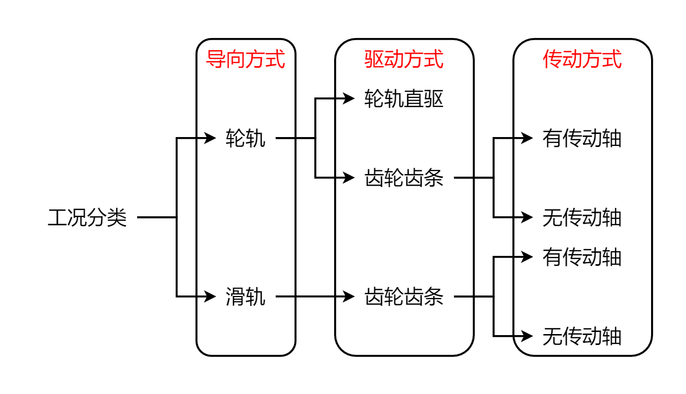

        <h1>低重力项目电机选型

## 4小原则：

选型结果应满足4小原则。

1. 满足 所需电机转速 < 额定转速（最大转速）

2. 满足 负载转动惯量 < 5 * 电机转子转动惯量

3. 满足 驱动扭矩 < 电机额定扭矩

4. 满足 驱动功率 < 电机额定功率

## 1 电机选型工况分类

    

## 2 计算过程

### 2.1 所需电机转速 计算过程

&emsp;&emsp;所需参数：天车所需速度 $v$、旋转构件直径 $D$（天车轮直径 $D$ 天车轮（轮轨驱动）、齿轮直径 $D$ 齿轮（齿轮齿条驱动））

&emsp;&emsp;计算过程：

&emsp;&emsp;（1）计算 旋转构件（天车轮、齿轮）转速 $n$（ $n$ 天车轮、 $n$ 齿轮）

$$
n = \frac{v}{\pi D}
$$

&emsp;&emsp;（2）计算 电机转速 $n$ 电机 

$$
n_{电机} = n \times i
$$

### 2.2 负载转动惯量 计算过程

&emsp;&emsp;所需参数：每个电机负载质量 $m$、旋转构件直径 $D$（天车轮直径 $D$ 天车轮 （轮轨驱动）、齿轮直径 $D$ 齿轮 （齿轮齿条驱动））、减速比 $i$、传动轴材料密度 $\gamma$、传动轴直径 $d$、传动轴长度 $L$

&emsp;&emsp;计算过程：

&emsp;&emsp;（1）计算 负载转动惯量 $J$（不存在传动轴）

$$
J = \frac{mD^2}{4i^2}
$$

&emsp;&emsp;（2）计算 负载转动惯量 $J$（存在传动轴）

&emsp;&emsp;&emsp;&emsp;1）计算 传动轴转动惯量 $J$ c 

$$
J_c = \frac{\pi\gamma}{32} \times d^4 \times L
$$

&emsp;&emsp;&emsp;&emsp;2）计算 负载转动惯量 $J$

$$
J = \frac{\frac{md^2}{4} + J_c}{i^2}
$$

### 2.3 驱动扭矩 计算过程

&emsp;&emsp;所需参数：天车所需速度 $a$、减速比 $i$、旋转构件直径 $D$（天车轮直径 $D$ 天车轮 （轮轨驱动）、齿轮直径 $D$ 齿轮 （齿轮齿条驱动））、每个电机负载质量 $m$、负载转动惯量 $J$、电机转子转动惯量 $J_m$

&emsp;&emsp;计算过程：

&emsp;&emsp;（1）计算 电机角加速度 $\alpha$

$$
\alpha = \frac{2ai}{D}
$$

&emsp;&emsp;（2）计算 工况涉及摩擦力扭矩（轮轨导向的摩擦力扭矩 $T_f$）

&emsp;&emsp;&emsp;&emsp;1）计算 轮轨导向的摩擦力扭矩

&emsp;&emsp;&emsp;&emsp;&emsp;&emsp;a. 计算 轮轨滚动摩擦力 $F_f$

$$
F_f = 0.05 \times m \times g
$$

&emsp;&emsp;&emsp;&emsp;&emsp;&emsp;其中，0.05为轮轨导向的摩擦系数； $g$ 为重力加速度。

&emsp;&emsp;&emsp;&emsp;&emsp;&emsp;b. 计算 轮轨导向的摩擦力扭矩 $T_f$

$$
T_f = F_f \times \frac{D}{2i}
$$

&emsp;&emsp;&emsp;&emsp;2）计算 滑轨导向的摩擦力扭矩

&emsp;&emsp;&emsp;&emsp;由于导轨的滑动摩擦系数为0.002，在运动过程中产生的阻碍运动加速度则为0.02，远小于运动加速度，因此可以忽略由摩擦力所产生的电机扭矩。

&emsp;&emsp;（3）计算 加速度扭矩 $T_a$

$$
T_a = (J+J_m) \times \alpha
$$

&emsp;&emsp;（4）计算 电机扭矩 $T$

$$
T = T_f + T_a
$$

### 2.4 驱动功率 计算过程

&emsp;&emsp;所需参数：电机转速 $n$ 电机 、电机扭矩 $T$

&emsp;&emsp;计算过程：计算 电机功率 $P$

$$
P = \frac{n_{电机}T}{9550}
$$
